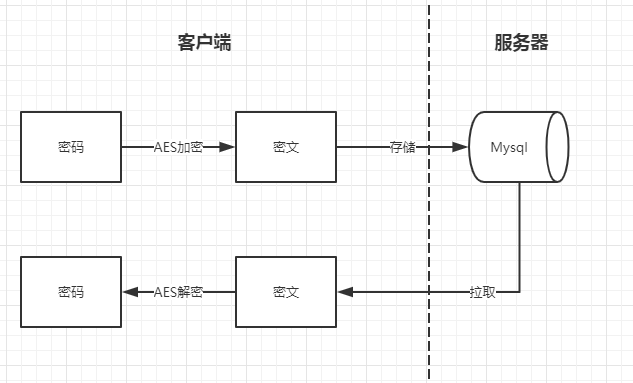

### travel-passowrd

一款基于spring-boot开发的密码管理工具，主要解决在公司和在家里的时候，各种密码来回转移不方便，但是直接丢记事本里面存云端，又不太安全，所以作为一个Javaer，我开发了这个来解决这个问题。

它并不轻量（如果不用框架倒是可以做得很小），但是开发起来快啊。虽然不能说是绝对安全，但是相对来说还是安全的（还是1password车票有点贵啊）。


#### 原理


在客户端通过AES256加密，将密文存储在远程服务器MySQL，在使用的时候，将密文从服务器拉取下来，在本地完成解密。


#### 功能

| 命令 | 描述 |
| ------ | ------ |
| help | 列出可用功能 |
| exit | 退出程序 |
| save | 保存密码，-i 指定密码id，表示当前操作是一个更新操作. -P 指定保存密码参数，用 \| 隔开，格式：名称\|用户名\|密码 |
| find |查找密码，-k 密码名称关键字（不带参数表示列出所有密码） |
| gen |  生成随机密码, -n 指定密码长度（默认12位） -s 指定是否包含特殊字符（默认不包含）|
| persist| 持久化服务器密码到本地, -r 表示当前操作是从本地的恢复密码到服务器 -p 指定密码文件的本地路径(默认为程序同级目录,名称为password)|


#### 打包 & 运行

```shell
mvn clean package
java -jar travel-password-0.1.0.jar

```

#### 配置

标准application.properties，请放心食用

```properties
#日志
logging.file=travel-password.log
#mysql
spring.datasource.driver-class-name=com.mysql.jdbc.Driver
spring.datasource.url=jdbc:mysql://localhost:3306/password?useSSL=true&useUnicode=true&characterEncoding=UTF-8
spring.datasource.username=root
spring.datasource.password=123456
#aes key,iv
travel.password.aes.key=travel_password
travel.password.aes.iv=password_iv
```

